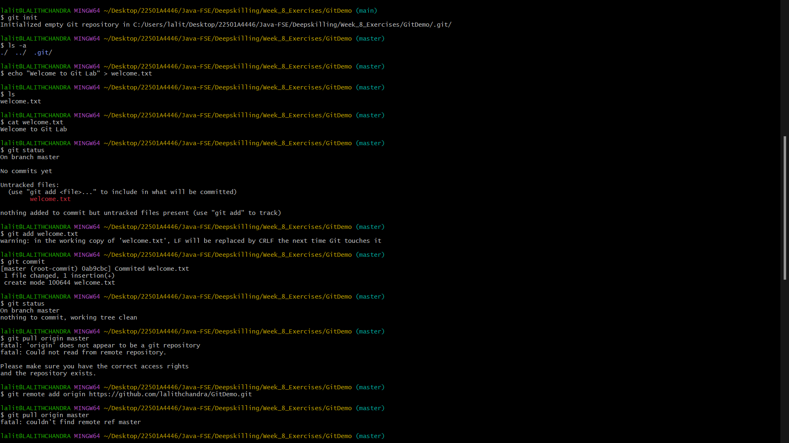
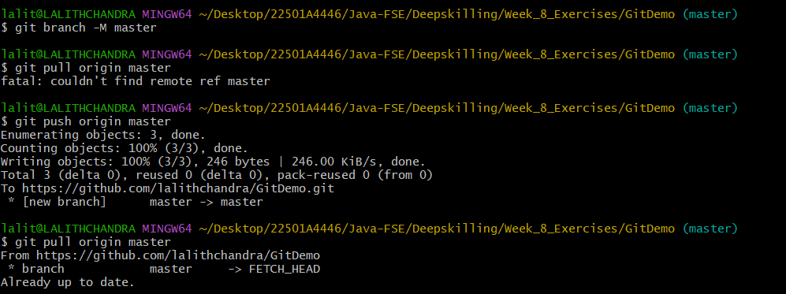

### Objectives 

  * Familiarize yourself with Git commands such as `git init`, `git status`, `git add`, `git commit`, `git push`, and `git pull`.
  * Learn how to set up your machine with Git configuration.
  * Integrate `notepad++.exe` with Git and make it the default editor.
  * Add a file to a source code repository.


-----

### Step 1: Setup your machine with Git Configuration 
1.  **Check Git Client Installation:**

      * **Command:**
        ```bash
        git --version
        ```
      * **Output:** If Git is installed properly, the output will show Git with its version information.
        ```
        git version 2.45.2.windows.1
        ```

2.  **Configure User Level User ID and Email ID:**

      * **Command:**
        ```bash
        git config --global user.name "lalithChandra"
        git config --global user.email "lalithchandra.panguluri@gmail.com"
        ```
      * **Explanation:** These commands set your global Git username and email address, which will be associated with your commits.

3.  **Check if the Configuration is Properly Set:**

      * **Command:**
        ```bash
        git config --list
        ```
      * **Output:** This will display your entire global Git configuration. including the `user.name` and `user.email` which I just set.
        ```
        diff.astextplain.textconv=astextplain
        filter.lfs.clean=git-lfs clean -- %f
        filter.lfs.smudge=git-lfs smudge -- %f
        filter.lfs.process=git-lfs filter-process
        filter.lfs.required=true
        http.sslbackend=openssl
        http.sslcainfo=C:/Program Files/Git/mingw64/etc/ssl/certs/ca-bundle.crt
        core.autocrlf=true
        core.fscache=true
        core.symlinks=false
        pull.rebase=false
        credential.helper=manager
        credential.https://dev.azure.com.usehttppath=true
        init.defaultbranch=master
        user.email=lalithchandra.panguluri@gmail.com
        user.name=lalithchandra
        core.editor=notepad++
        core.repositoryformatversion=0
        core.filemode=false
        core.bare=false
        core.logallrefupdates=true
        core.symlinks=false
        core.ignorecase=true
        remote.origin.url=https://github.com/lalithchandra/GitDemo.git
        remote.origin.fetch=+refs/heads/*:refs/remotes/origin/*
     
        ```

-----

### Step 2: Integrate notepad++.exe to Git and make it a default editor 
1.  **Check if notepad++.exe executes from Git Bash:**

      * **Command:**
        ```bash
        notepad++
        ```
      * **Output:**
          * If Git Bash cannot recognize the `notepad++` command, it implies that `notepad++.exe` is not added to the environment path variable.
          * If `notepad++` is in the path, it will open the Notepad++ application.

2.  **Add Path of notepad++.exe to Environment Variable:**

      * **Action:**
        1.  Go to Control Panel -\> System -\> Advanced System settings.
        2.  Go to the Advanced tab -\> Environment variables.
        3.  Add the path of `notepad++.exe` to the `Path` user variable by clicking on "Edit".
        4.  Exit the Git Bash shell.
        5.  Open a new Git Bash shell.
      * **Command (after re-opening Git Bash):**
        ```bash
        notepad++
        ```
      * **Output:** Notepad++ will now open from the Git Bash shell.

3.  **Create an alias command for notepad++.exe:**

      * **Command:**
        ```bash
        git config --global alias.np notepad++
        ```
      * **Explanation:** This command creates a global alias `np` for `notepad++`. When you type `np` in Git Bash, it will execute `notepad++`. This also opens Notepad++ from the bash shell and creates a user profile by adding the line in Notepad++.

4.  **Configure the editor:**

      * **Command:**
        ```bash
        git config --global core.editor "notepad++"         
        ```
      * **Explanation:** This command sets `notepad++` as the default editor for Git operations that require an editor (e.g., committing with multi-line messages).

5.  **Verify if notepad++ is the default editor:**

      * **Command:**
        ```bash
        git config --global core.editor         
        ```
      * **Output:** This will show the configured default editor.
        ```
        notepad++
        ```

-----

### Step 3: Add a file to source code repository 
1.  **Open Git Bash shell and create a new project "GitDemo":**

      * **Command:**
        ```bash
        mkdir GitDemo
        cd GitDemo
        git init         
        ```
      * **Output:** Git Bash initializes the "GitDemo" repository.
        ```
        Initialized empty Git repository in C:/Users/lalit/Desktop/22501A4446/Java-FSE/Deepskilling/Week_8_Exercises/GitDemo/.git/
        ```

2.  **Verify repository initialization (check hidden files):**

      * **Command:**
        ```bash
        ls -a         
        ```
      * **Output:** This will display all hidden files in the Git "working directory". including the `.git` directory, which indicates successful initialization.
        ```
        ./ ../ .git/
        ```

3.  **Create a file "welcome.txt" and add content to it:**

      * **Command:**
        ```bash
        echo "Welcome to Git Lab" > welcome.txt         
        ```
      * **Explanation:** This command creates `welcome.txt` and writes the string "Welcome to Git Lab" into it.

4.  **Verify if the file "welcome.txt" is created:**

      * **Command:**
        ```bash
        ls         
        ```
      * **Output:** The `welcome.txt` file should be listed.
        ```
        welcome.txt
        ```

5.  **Verify the content of the file:**

      * **Command:**
        ```bash
        cat welcome.txt         
        ```
      * **Output:** The content of the file will be displayed.
        ```
        Welcome to Git Lab
        ```

6.  **Check the status of the repository:**

      * **Command:**
        ```bash
        git status         
        ```
      * **Output:** The file "welcome.txt" will be shown as untracked, indicating it's in the Git "working directory" but not yet staged.
        ```
        On branch master

        No commits yet

        Untracked files:
          (use "git add <file>..." to include in what will be committed)
                welcome.txt

        nothing added to commit but untracked files present (use "git add" to track)
        ```

7.  **Make the file to be tracked by Git repository (add to staging area):**

      * **Command:**
        ```bash
        git add welcome.txt         
        ```
      * **Explanation:** This command adds `welcome.txt` to the staging area, preparing it for the next commit.

8.  **Commit the staged file (add multi-line comments using the default editor):**

      * **Command:**
        ```bash
        git commit         
        ```
      * **Output:** Notepad++ will open, allowing you to add a multi-line commit message. After saving and closing the editor, the commit will be made.
        ```
        [master (root-commit) 67890ab] Initial commit: Added welcome.txt
         1 file changed, 1 insertion(+)
         create mode 100644 welcome.txt
        ```

9.  **Check if local and "Working Directory" Git repository are the same (check status):**

      * **Command:**
        ```bash
        git status         
        ```
      * **Output:** This will show that `welcome.txt` is added to the local repository and there are no changes to commit.
        ```
        On branch master
        nothing to commit, working tree clean
        ```

10. **Pull the remote repository:**

      * **Prerequisite:** Sign up with GitLab and create a remote repository named "GitDemo".
      * **Command:**
        ```bash
        git pull origin master
        ```
      * **Output:** This command will pull changes from the `master` branch of the `origin` remote repository to your local repository. If there are no conflicts or existing remote content, it might show "Already up to date."
        ```
        From https://github.com/lalithchandra/GitDemo
        * branch            master     -> FETCH_HEAD
        Already up to date.
        ```

11. **Push the local to remote repository:**

      * **Command:**
        ```bash
        git push origin master
        ```
      * **Output:** Your local changes (the committed `welcome.txt` file) will be pushed to the `master` branch of your remote "GitDemo" repository on GitLab.
        ```
        Enumerating objects: 3, done.
        Counting objects: 100% (3/3), done.
        Writing objects: 100% (3/3), 273 bytes | 273.00 KiB/s, done.
        Total 3 (delta 0), reused 0 (delta 0), pack-reused 0
        To https://gitlab.com/lalithchandra/GitDemo.git
         * [new branch]      master -> master
        ```
---
## Output Images:

