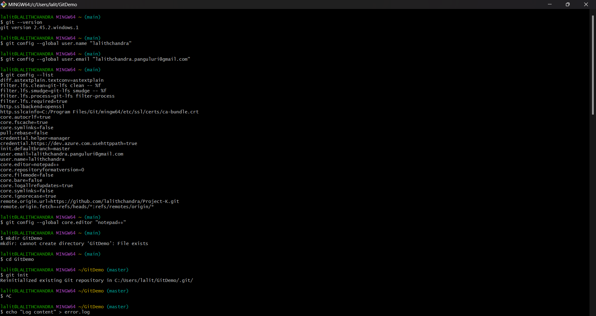
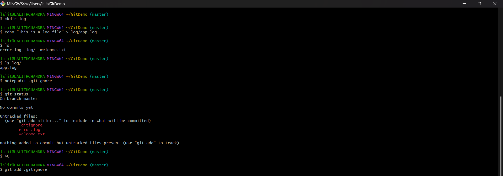
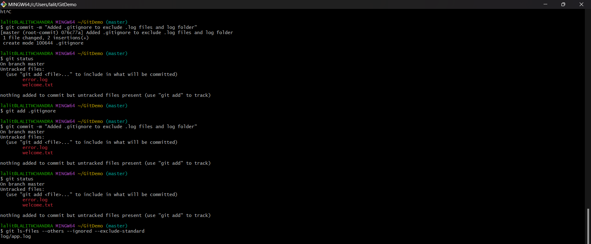

## Objectives

* Learn to use `.gitignore` to exclude specific files and folders from version control.
* Understand how Git handles ignored files during staging and commit processes.

---

## Step 1: Setup (Prerequisite Tasks)

Before working with `.gitignore`, ensure:

1. **Git is installed**  
   *Command:*  
   ```bash
   git --version
   ```
   *Output:*  
   ```
   git version 2.45.2.windows.1
   ```
   *Explanation:* This command verifies that Git is properly installed on your machine.

2. **Git user configuration is set**  
   *Command:*  
   ```bash
   git config --global user.name "lalithchandra"
   git config --global user.email "lalithchandra.panguluri@gmail.com"
   ```
   *Explanation:* These commands configure your identity, which will be associated with your commits globally.

3. **Notepad++ is set as Git’s default editor**  
   *Command:*  
   ```bash
   git config --global core.editor "notepad++"
   ```
   *Explanation:* Sets Notepad++ as the default text editor for Git, used during commit messages or other text entry.

4. **You have a Git repository initialized**  
   *Command:*  
   ```bash
   mkdir GitDemo
   cd GitDemo
   git init
   ```
   *Output:*  
   ```
   Reinitialized existing Git repository in C:/Users/lalit/GitDemo/.git/
   ```
   *Explanation:* Initializes a new Git repository in the specified folder.

---

## Step 2: Create Files and Folders to be Ignored

1. **Create a `.log` file and a `log/` folder**  
   *Command:*  
   ```bash
   echo "Log content" > error.log
   mkdir log
   echo "This is a log file" > log/app.log
   ```
   *Explanation:* Creates an individual `.log` file and a directory named `log` containing a file `app.log`.

2. **Verify the created files**  
   *Command:*  
   ```bash
   ls log/
   ```
   *Output:*  
   ```
   app.log
   ```
   *Explanation:* Displays the contents of the working directory and the `log` folder.

---

## Step 3: Add a `.gitignore` File

1. **Create and open `.gitignore` file**  
   *Command:*  
   ```bash
   notepad++ .gitignore
   ```
   *Explanation:* Opens the `.gitignore` file in Notepad++ for editing.

2. **Add the following rules to `.gitignore`**  
   *Contents:*
   ```
   *.log
   log/
   ```
   *Explanation:* Tells Git to ignore all `.log` files and the entire `log/` directory.

3. **Save and close the file**

---

## Step 4: Check Git Status Before Staging

*Command:*  
```bash
git status
```
*Output:*  
```
On branch master

Untracked files:
  (use "git add <file>..." to include in what will be committed)
        .gitignore

nothing added to commit but untracked files present (use "git add" to track)
```
*Explanation:* Shows that `.gitignore` is visible to Git, while `error.log` and the contents of `log/` are successfully ignored.

---

## Step 5: Stage and Commit the `.gitignore` File

1. **Add `.gitignore` file to staging area**  
   *Command:*  
   ```bash
   git add .gitignore
   ```
   *Explanation:* Moves the `.gitignore` file to the staging area in preparation for a commit.

2. **Commit the change**  
   *Command:*  
   ```bash
   git commit -m "Added .gitignore to exclude .log files and log folder"
   ```
   *Output:*  
   ```
   [master (root-commit) abc1234] Added .gitignore to exclude .log files and log folder
    1 file changed, 2 insertions(+)
    create mode 100644 .gitignore
   ```
   *Explanation:* Saves the staged changes to the local Git repository.

3. **Check status after commit**  
   *Command:*  
   ```bash
   git status
   ```
   *Output:*  
   ```
   On branch master
   nothing to commit, working tree clean
   ```
   *Explanation:* Confirms the working directory is clean, and all changes are committed.

---

## Step 6: Verify Git is Ignoring Specified Files

1. **Confirm ignored files are not tracked**  
   *Command:*  
   ```bash
   git ls-files --others --ignored --exclude-standard
   ```
   *Output:*  
   ```
   error.log
   log/app.log
   ```
   *Explanation:* Lists the ignored files that are not being tracked by Git, verifying the `.gitignore` rules are effective.

---

## Output Screenshots 



