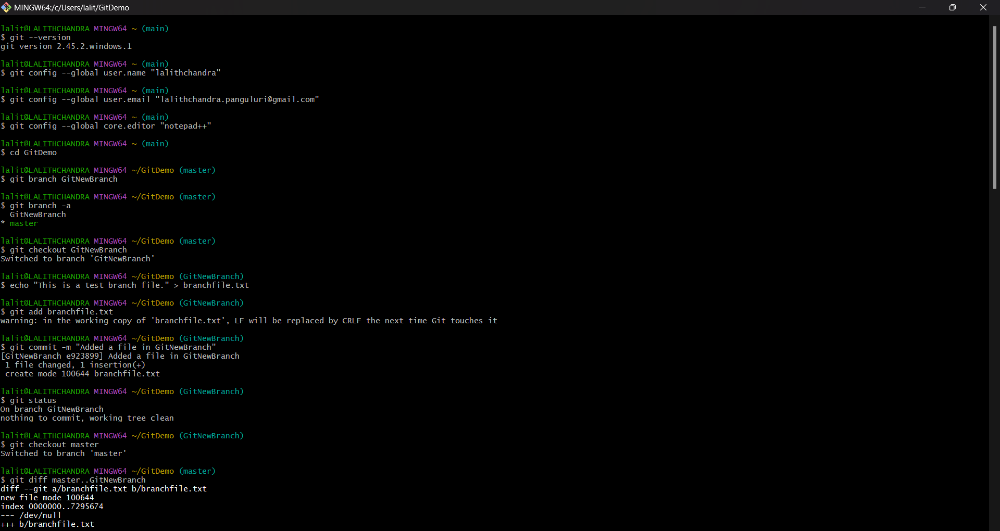
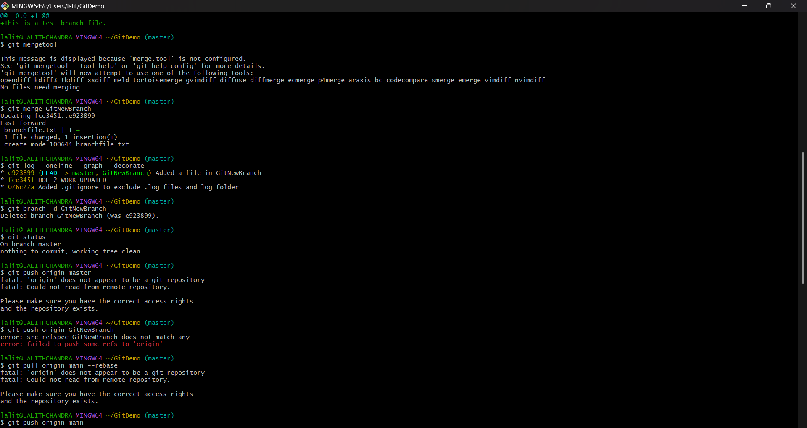
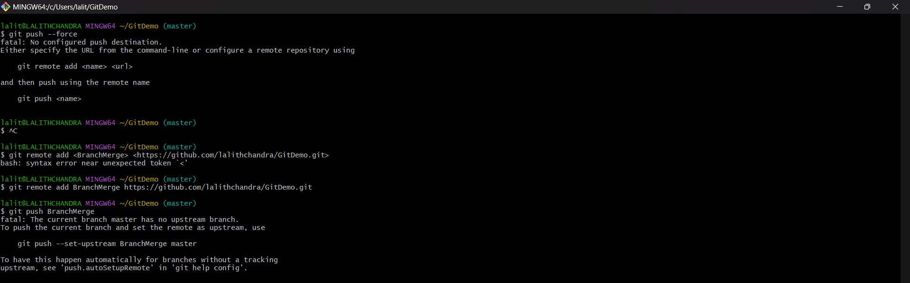

## Objectives

* Explain branching and merging in Git.
* Learn how to create a branch and merge request in GitLab.
* Practice using visual merge tools like P4Merge for Windows.

---

## Prerequisites

* Git must be installed and configured.
* P4Merge must be installed and integrated as the merge/diff tool.
* A Git repository should be initialized and available locally.
* A remote repository on GitHub or GitLab should be linked.

---

## Step 1: Create a New Branch

1. **Create a new branch `GitNewBranch`**
   *Command:*  
   ```bash
   git branch GitNewBranch
   ```
   *Output:* No output if successful.
   *Explanation:* Creates a new branch based on the current branch (typically `master` or `main`).

2. **List all local and remote branches**
   *Command:*  
   ```bash
   git branch -a
   ```
   *Output:*  
   ```
   * master
     GitNewBranch
     remotes/origin/master
   ```
   *Explanation:* Lists all available branches. `*` denotes the current branch.

3. **Switch to the newly created branch**
   *Command:*  
   ```bash
   git checkout GitNewBranch
   ```
   *Output:*  
   ```
   Switched to branch 'GitNewBranch'
   ```
   *Explanation:* Changes your working directory to the new branch.

---

## Step 2: Make Changes in the Branch

1. **Create new files in the branch**
   *Command:*  
   ```bash
   echo "This is a test branch file." > branchfile.txt
   ```

2. **Stage and commit the new file**
   *Command:*  
   ```bash
   git add branchfile.txt
   git commit -m "Added a file in GitNewBranch"
   ```
   *Output:*  
   ```
   [GitNewBranch abc1234] Added a file in GitNewBranch
    1 file changed, 1 insertion(+)
    create mode 100644 branchfile.txt
   ```

3. **Check the branch status**
   *Command:*  
   ```bash
   git status
   ```
   *Output:*  
   ```
   On branch GitNewBranch
   nothing to commit, working tree clean
   ```

---

## Step 3: Merge the Branch into Master

1. **Switch back to master**
   *Command:*  
   ```bash
   git checkout master
   ```
   *Output:*  
   ```
   Switched to branch 'master'
   ```

2. **List differences between master and branch**
   *Command:*  
   ```bash
   git diff master..GitNewBranch
   ```
   *Explanation:* Shows line-by-line differences between the two branches.

3. **View visual diff using P4Merge**
   *Command:*  
   ```bash
   git mergetool
   ```
   *Output:* Opens P4Merge tool for visual comparison.
   *Explanation:* Helps resolve conflicts and view changes visually.

4. **Merge the branch into master**
   *Command:*  
   ```bash
   git merge GitNewBranch
   ```
   *Output:*  
   ```
   Updating 1234567..abc1234
   Fast-forward
    branchfile.txt | 1 +
    1 file changed, 1 insertion(+)
    create mode 100644 branchfile.txt
   ```

5. **View log as a graph**
   *Command:*  
   ```bash
   git log --oneline --graph --decorate
   ```
   *Output:* 
   ```bash
   * e923899 (HEAD -> master, GitNewBranch) Added a file in GitNewBranch
   * fce3451 HOL-2 WORK UPDATED
   * 076c77a Added .gitignore to exclude .log files and log folder
   ```

6. **Delete the merged branch**
   *Command:*  
   ```bash
   git branch -d GitNewBranch
   ```
   *Output:*  
   ```
   Deleted branch GitNewBranch (was e923899).
   ```

7. **Check final status**
   *Command:*  
   ```bash
   git status
   ```
   *Output:*  
   ```
   On branch master
   nothing to commit, working tree clean
   ```

---

## Step 4: GitLab Merge Request

> This part is done on GitLab UI

1. Push both branches to GitLab:
   ```bash
   git push origin master
   git push origin GitNewBranch
   ```

2. Go to GitLab and create a **Merge Request** from `GitNewBranch` to `master`.

3. Review, approve, and merge it from the GitLab interface.

---

## Output Screenshots



