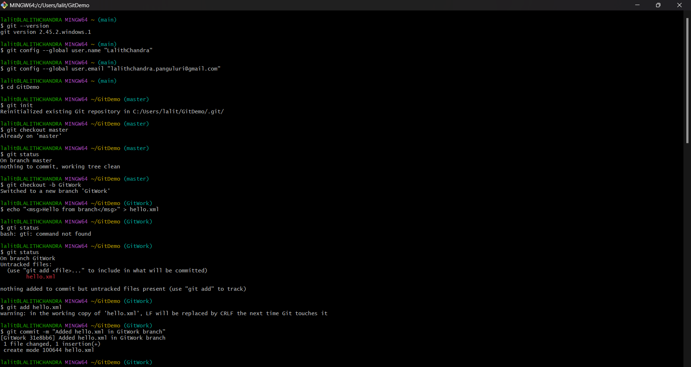
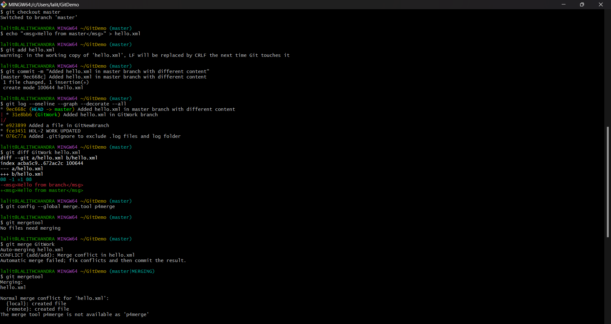
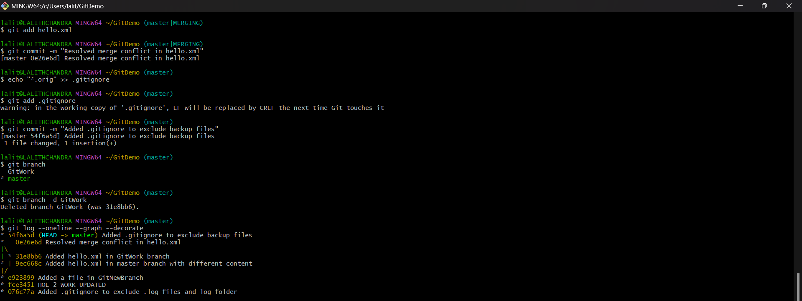
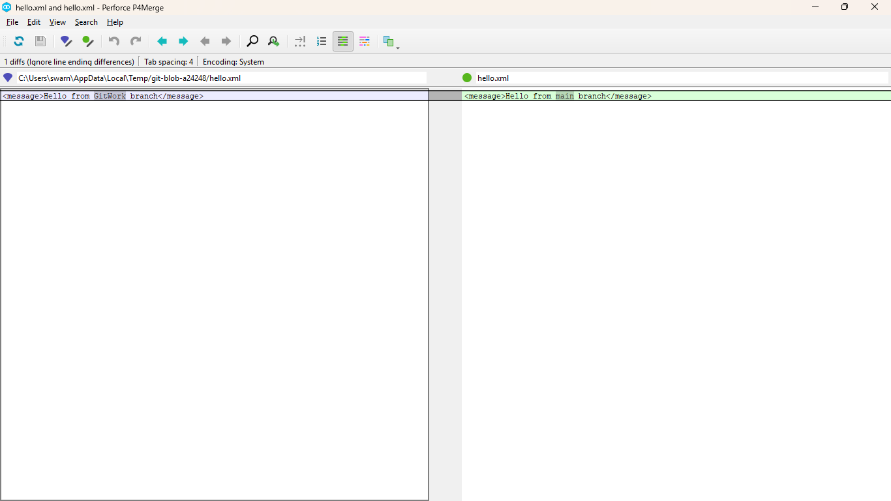

## Git Conflict Resolution Hands-On Lab

### Objectives

* Understand how to resolve conflicts during a Git merge.
* Learn how two users updating the same file can result in a merge conflict.
* Practice conflict resolution using Git tools such as `git diff`, `P4Merge`, and `git mergetool`.

---

### Step 1: Verify Clean State of Master Branch

**Explanation:** Ensure the working directory is clean and you're on the `master` branch.

* **Command:**
  ```bash
  git checkout master
  git status
  ```

* **Output:**
  ```
  On branch master
  nothing to commit, working tree clean
  ```

---

### Step 2: Create a Branch and Add File

**Explanation:** Create a new branch `GitWork`, add a new file `hello.xml` with some content.

* **Command:**
  ```bash
  git checkout -b GitWork
  echo "<msg>Hello from branch</msg>" > hello.xml
  git status
  ```

* **Output:**
  ```
  On branch GitWork
    Untracked files:
        (use "git add <file>..." to include in what will be committed)
        hello.xml

    nothing added to commit but untracked files present (use "git add" to track)
  ```

---

### Step 3: Commit Changes in Branch

**Explanation:** Stage and commit the file in the `GitWork` branch.

* **Command:**
  ```bash
  git add hello.xml
  git commit -m "Added hello.xml in GitWork branch"
  ```

* **Output:**
  ```
  [GitWork abc1234] Added hello.xml in GitWork branch
   1 file changed, 1 insertion(+)
   create mode 100644 hello.xml
  ```

---

### Step 4: Switch to Master and Modify the Same File

**Explanation:** Simulate another change to the same file on the master branch, causing a conflict scenario.

* **Command:**
  ```bash
  git checkout master
  echo "<msg>Hello from master</msg>" > hello.xml
  git add hello.xml
  git commit -m "Added hello.xml in master branch with different content"
  ```

* **Output:**
  ```
  Switched to branch 'master'
  [master def5678] Added hello.xml in master branch with different content
  ```

---

### Step 5: View Commit History

**Explanation:** View the commit history to see the branches diverged.

* **Command:**
  ```bash
  git log --oneline --graph --decorate --all
  ```

* **Output:**
  ```
  * 9ec668c (HEAD -> master) Added hello.xml in master branch with different content
    | * 31e8bb6 (GitWork) Added hello.xml in GitWork branch
    |/
    * e923899 Added a file in GitNewBranch
    * fce3451 HOL-2 WORK UPDATED
    * 076c77a Added .gitignore to exclude .log files and log folder

  ```

---

### Step 6: Compare Differences

**Explanation:** Use Git diff to check how the file content differs between master and the branch.

* **Command:**
  ```bash
  git diff GitWork hello.xml
  ```

* **Output:**
  ```diff
  -<msg>Hello from master</msg>
  +<msg>Hello from branch</msg>
  ```

---

### Step 7: Use Visual Diff Tool (P4Merge)

**Explanation:** Use a visual tool like P4Merge to compare files more clearly.

* **Command:**
  ```bash
  git config --global merge.tool p4merge
  git mergetool
  ```

* **Behavior:** P4Merge opens a 3-way diff viewer showing differences and conflicts between `master`, `GitWork`, and base.

---

### Step 8: Merge the Branch to Master

**Explanation:** Attempt to merge the branch into master. It should result in a conflict.

* **Command:**
  ```bash
  git merge GitWork
  ```

* **Output:**
  ```
  Auto-merging hello.xml
  CONFLICT (content): Merge conflict in hello.xml
  Automatic merge failed; fix conflicts and then commit the result.
  ```

---

### Step 9: Resolve Conflict Using 3-Way Merge Tool

**Explanation:** Use Git’s mergetool to resolve the merge conflict interactively.

* **Command:**
  ```bash
  git mergetool
  ```

* **Behavior:** P4Merge opens. Manually resolve conflicts, then save and close.

---

### Step 10: Finalize Merge

**Explanation:** Add the resolved file and commit the final result.

* **Command:**
  ```bash
  git add hello.xml
  git commit -m "Resolved merge conflict in hello.xml"
  ```

* **Output:**
  ```
  [master 0e26e6d] Resolved merge conflict in hello.xml
  ```

---

### Step 11: Add Backup Files to .gitignore

**Explanation:** Exclude temporary or backup files generated during merge conflict resolution.

* **Command:**
  ```bash
  echo "*.orig" >> .gitignore
  git add .gitignore
  git commit -m "Added .gitignore to exclude backup files"
  ```

* **Output:**
  ```
  [master 54f6a5d] Added .gitignore to exclude backup files
    1 file changed, 1 insertion(+)

  ```

---

### Step 12: Clean Up Branches

**Explanation:** Delete the merged branch to keep the repository clean.

* **Command:**
  ```bash
  git branch
  git branch -d GitWork
  ```

* **Output:**
  ```
  Deleted branch GitWork (was 31e8bb6).
  ```

---

### Step 13: Verify History After Merge

**Explanation:** View the final commit graph after merge resolution.

* **Command:**
  ```bash
  git log --oneline --graph --decorate
  ```

* **Output:**
  ```
  * 54f6a5d (HEAD -> master) Added .gitignore to exclude backup files
    *   0e26e6d Resolved merge conflict in hello.xml
    |\
    | * 31e8bb6 Added hello.xml in GitWork branch
    * | 9ec668c Added hello.xml in master branch with different content
    |/
    * e923899 Added a file in GitNewBranch
    * fce3451 HOL-2 WORK UPDATED
    * 076c77a Added .gitignore to exclude .log files and log folder
  ```
---

## Output Screenshots




