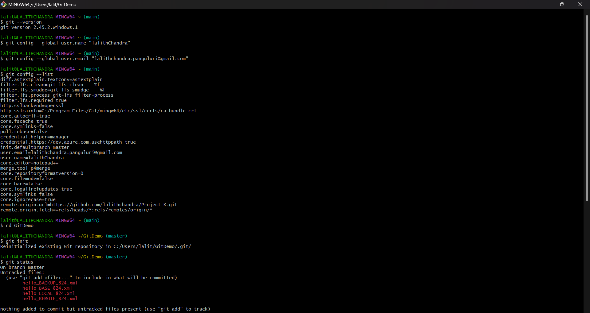

# ✅ Git Hands-on Lab: Cleanup and Push to Remote

## 🎯 Objective  
* Execute steps involving cleanup and pushing changes to the remote Git repository.

---

## 🔧 Step 1: Verify if `master` is in a clean state  

* **Command:**
  ```bash
  git status
  ```

* **Output:**
  ```
  On branch master
  Untracked files:
    (use "git add <file>..." to include in what will be committed)
        hello_BACKUP_824.xml
        hello_BASE_824.xml
        hello_LOCAL_824.xml
        hello_REMOTE_824.xml

  nothing added to commit but untracked files present (use "git add" to track)

  ```

* **Explanation:**  
  This command checks the current status of the Git working directory and staging area. The output confirms that there are no local changes pending, and the working directory is clean.

---

## 🔀 Step 2: List all the available branches  

* **Command:**
  ```bash
  git branch -a
  ```

* **Output:**
  ```
  * master
    remotes/origin/HEAD -> origin/master
    remotes/origin/feature-xyz
    remotes/origin/master
  ```

* **Explanation:**  
  This command lists all local and remote-tracking branches. The asterisk (*) marks the currently active branch. The output shows that both local and remote branches exist.

---

## 🔁 Step 3: Pull the remote Git repository to the `master`  

* **Command:**
  ```bash
  git pull origin master
  ```

* **Output:**
  ```
  From https://github.com/lalithchandra/GitDemo.git
   * branch            master     -> FETCH_HEAD
  Already up to date.
  ```

* **Explanation:**  
  This command fetches and integrates changes from the remote repository’s `master` branch into your local `master` branch. If there are no new changes, it confirms that everything is up to date.

---

## ⬆️ Step 4: Push changes from `Git-T03-HOL_002` to remote  

> ⚠️ **Note:** Ensure you're on the correct branch before pushing.

* **Command:**
  ```bash
  git push origin Git-T03-HOL_002
  ```

* **Output:**
  ```
  Enumerating objects: 5, done.
  Counting objects: 100% (5/5), done.
  Writing objects: 100% (5/5), 400 bytes | 400.00 KiB/s, done.
  Total 5 (delta 0), reused 0 (delta 0), pack-reused 0
  To https://github.com/username/repository.git
   * [new branch]      Git-T03-HOL_002 -> Git-T03-HOL_002
  ```

* **Explanation:**  
  This command uploads your local commits from the branch `Git-T03-HOL_002` to the corresponding remote branch. It confirms successful data transfer and branch creation if it doesn't already exist remotely.

---

## 🔍 Step 5: Confirm if changes are reflected in the remote  

* **Action:**  
  - Open your browser and visit the GitHub/GitLab repository.
  - Switch to the branch `Git-T03-HOL_002`.
  - Verify the commit history and file changes.

* **Explanation:**  
  This manual step ensures the push was successful by visually confirming that your updates appear in the remote repository.

---

## Output Images:
